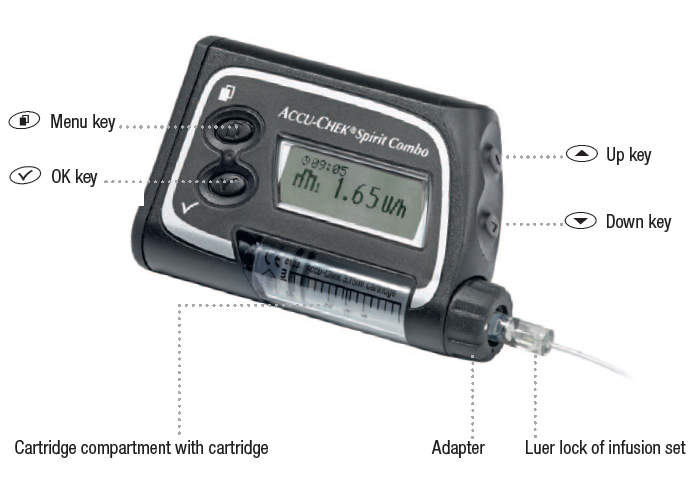

# Pumps compatible with AndroidAPS

Currently with AndroidAPS you essentially have the choice of two insulin pumps, the Roche Spirit Combo and the SOOIL Dana* R or RS. 

## Roche Spirit Combo

The Combo is a widely available pump and all versions of it can be used for looping with AndroidAPS. You will need to install a special driver on your phone known as Ruffy which emulates the Combo handset and issues the appropriate commands via Bluetooth. This makes it somewhat slow to transfer commands to the pump but that's not a problem in this situation.

## The SOOIL Dana* R or RS

The Dana* RS is an upgrade to the Dana* R and both have been designed with remote operation via Bluetooth in mind. 

currently works with the Dana* R, Dana* RS and Combo pumps. The Dana* R and Combo have been available on the market for a while so many people already have access to these, and Dana* RS as an upgrade to the Dana* R is becoming a more common choice.  If you need to choose a pump to upgrade to or buy then people often ask which to choose. Details of the various distributors is in [this spreadsheet](https://drive.google.com/open?id=1CRfmmjA-0h_9nkRViP3J9FyflT9eu-a8HeMrhrKzKz0), please share the details of yours if not already listed.

The Combo is a solid pump. And loopable.

The advantages of the Dana* RS as the pump of choice however are:

* Sooil did state that controlling the pump from a phone (didn't not-specifically state looping) would NOT void the warranty. IME-DC stated they would just hand out a replacement send the pump to Sooil - so they wouldn't even know if you were looping or not. This makes the Dana* R/RS pumps the only pumps that are under warranty while looping. (Roche excludes any use that is not in their manual.)

* The Dana*R/RS connects to almost any phone with Android >= 5.1 without the need to flash lineage. If your phone breaks you usually can find easily any phone that works with the Dana*R/RS pumps as quick replacement... not so easy with the Combo. (This might change in the future when Android 8.1 gets more popular)

* Initial pairing is simpler with the Dana* RS. But you usually only do this once so it only impacts if you want to test a new feature with different pumps.

* So far the Combo works with screen parsing. In general that works great but it is slow. For looping this does not matter much as everything works in the background. Still there is much more time you need to be connected so more time where the BT connection might break, which isn't so easy if you walk away from your phone whilst bolusing & cooking. 

* The Combo vibrates on the end of TBRs, the Dana* R vibrates (or beeps) on SMB. At night time you are likely to be using TBRs more than SMB.  The Dana* RS is configurable that it does neither beeps or vibrates.

* Reading the history on the RS in a few seconds with carbs makes it possible to switch phones easily while offline and continue looping as soon a soon as some CGM values are in.

* All pumps AndroidAPS can talk with are waterproof on delivery. Only the Dana pumps are also "waterproof by warranty" due to the sealed battery compartment and reservoir filling system. 

The Combo of course is a very good pump. And loopable. It also has the advantage of many more infusion set types to chose from as it has a standard luer lock. And the battery is a default one you can buy at any gas station, 24 hour convenience store and if you really need one, you can steal/borrow it from the remote control in the hotel room ;-)

Details of the status of other pumps that may have the potential to work with AndroidAPS are listed on the [Future (possible) Pumps](Future-possible-Pump-Drivers.md) page.
